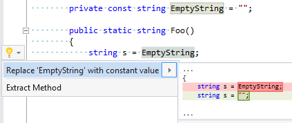

## Replace expression with constant value

| Property           | Value                                  |
| ------------------ | -------------------------------------- |
| Id                 | RR0127                                 |
| Title              | Replace expression with constant value |
| Syntax             | expression that has constant value     |
| Enabled by Default | &#x2713;                               |

### Usage

[full list of refactorings](Refactorings.md)
*\(Generated with [DotMarkdown](http://github.com/JosefPihrt/DotMarkdown)\)*