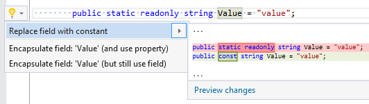

## Use constant instead of field

| Property           | Value                         |
| ------------------ | ----------------------------- |
| Id                 | RR0128                        |
| Title              | Use constant instead of field |
| Syntax             | read\-only field              |
| Enabled by Default | &#x2713;                      |

### Usage

[full list of refactorings](Refactorings.md)
*\(Generated with [DotMarkdown](http://github.com/JosefPihrt/DotMarkdown)\)*