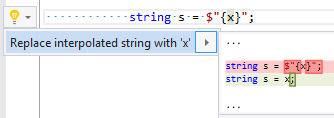

## Replace interpolated string with interpolation expression

| Property           | Value                                                     |
| ------------------ | --------------------------------------------------------- |
| Id                 | RR0135                                                    |
| Title              | Replace interpolated string with interpolation expression |
| Syntax             | interpolated string with single interpolation and no text |
| Span               | interpolation                                             |
| Enabled by Default | &#x2713;                                                  |

### Usage

[full list of refactorings](Refactorings.md)
*\(Generated with [DotMarkdown](http://github.com/JosefPihrt/DotMarkdown)\)*