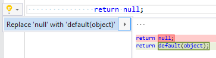

## Replace null literal expression with default expression

| Property           | Value                                                   |
| ------------------ | ------------------------------------------------------- |
| Id                 | RR0139                                                  |
| Title              | Replace null literal expression with default expression |
| Syntax             | argument                                                |
| Enabled by Default | &#x2713;                                                |

### Usage

## See Also

* [Full list of refactorings](Refactorings.md)

*\(Generated with [DotMarkdown](http://github.com/JosefPihrt/DotMarkdown)\)*