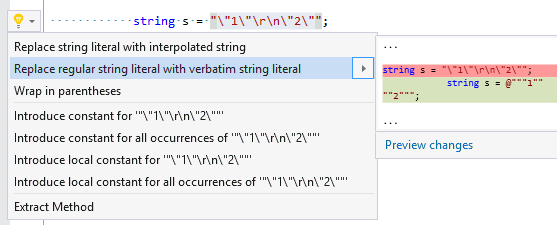

## Replace regular string literal with verbatim string literal

| Property           | Value                                                       |
| ------------------ | ----------------------------------------------------------- |
| Id                 | RR0142                                                      |
| Title              | Replace regular string literal with verbatim string literal |
| Syntax             | regular string literal                                      |
| Enabled by Default | &#x2713;                                                    |

### Usage

[full list of refactorings](Refactorings.md)

*\(Generated with [DotMarkdown](http://github.com/JosefPihrt/DotMarkdown)\)*