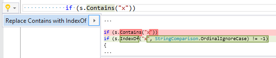

## Replace string\.Contains with string\.IndexOf

| Property           | Value                                         |
| ------------------ | --------------------------------------------- |
| Id                 | RR0144                                        |
| Title              | Replace string\.Contains with string\.IndexOf |
| Syntax             | method invocation                             |
| Span               | method name                                   |
| Enabled by Default | &#x2713;                                      |

### Usage

[full list of refactorings](Refactorings.md)
*\(Generated with [DotMarkdown](http://github.com/JosefPihrt/DotMarkdown)\)*