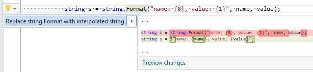

## Replace string\.Format with interpolated string

| Property           | Value                                           |
| ------------------ | ----------------------------------------------- |
| Id                 | RR0145                                          |
| Title              | Replace string\.Format with interpolated string |
| Syntax             | string\.Format method                           |
| Enabled by Default | &#x2713;                                        |

### Usage

## See Also

* [Full list of refactorings](Refactorings.md)

*\(Generated with [DotMarkdown](http://github.com/JosefPihrt/DotMarkdown)\)*