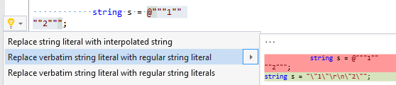

## Replace verbatim string literal with regular string literal

| Property           | Value                                                       |
| ------------------ | ----------------------------------------------------------- |
| Id                 | RR0148                                                      |
| Title              | Replace verbatim string literal with regular string literal |
| Syntax             | verbatim string literal                                     |
| Enabled by Default | &#x2713;                                                    |

### Usage

## See Also

* [Full list of refactorings](Refactorings.md)

*\(Generated with [DotMarkdown](http://github.com/JosefPihrt/DotMarkdown)\)*