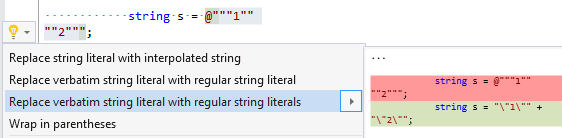

## Replace verbatim string literal with regular string literals

| Property           | Value                                                        |
| ------------------ | ------------------------------------------------------------ |
| Id                 | RR0149                                                       |
| Title              | Replace verbatim string literal with regular string literals |
| Syntax             | multiline verbatim string literal                            |
| Enabled by Default | &#x2713;                                                     |

### Usage

## See Also

* [Full list of refactorings](Refactorings.md)

*\(Generated with [DotMarkdown](http://github.com/JosefPihrt/DotMarkdown)\)*