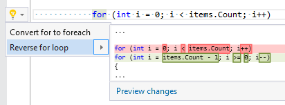

## Reverse for loop

| Property           | Value            |
| ------------------ | ---------------- |
| Id                 | RR0152           |
| Title              | Reverse for loop |
| Syntax             | for statement    |
| Enabled by Default | &#x2713;         |

### Usage

[full list of refactorings](Refactorings.md)
*\(Generated with [DotMarkdown](http://github.com/JosefPihrt/DotMarkdown)\)*