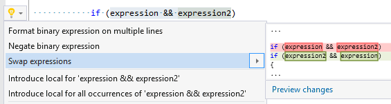

## Swap expressions in binary expression

Property | Value
--- | --- 
Id | RR0159
Title | Swap expressions in binary expression
Syntax | logical and/or expression
Span | binary operator
Enabled by Default | yes

### Usage

[full list of refactorings](Refactorings.md)
