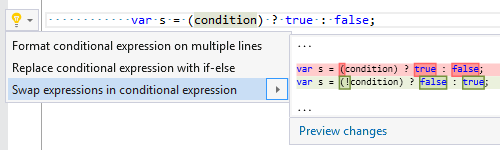

## Swap expressions in conditional expression

| Property           | Value                                      |
| ------------------ | ------------------------------------------ |
| Id                 | RR0160                                     |
| Title              | Swap expressions in conditional expression |
| Syntax             | conditional expression                     |
| Span               | condition                                  |
| Enabled by Default | &#x2713;                                   |

### Usage

[full list of refactorings](Refactorings.md)

*\(Generated with [DotMarkdown](http://github.com/JosefPihrt/DotMarkdown)\)*