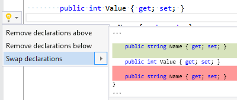

## Swap member declarations

| Property           | Value                                  |
| ------------------ | -------------------------------------- |
| Id                 | RR0161                                 |
| Title              | Swap member declarations               |
| Syntax             | empty line between member declarations |
| Enabled by Default | &#x2713;                               |

### Usage

[full list of refactorings](Refactorings.md)

*\(Generated with [DotMarkdown](http://github.com/JosefPihrt/DotMarkdown)\)*