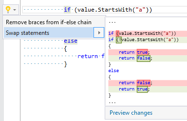

## Swap statements in if\-else

| Property           | Value                                   |
| ------------------ | --------------------------------------- |
| Id                 | RR0162                                  |
| Title              | Swap statements in if\-else             |
| Syntax             | if statement                            |
| Span               | top if keyword or selected if statement |
| Enabled by Default | &#x2713;                                |

### Usage

[full list of refactorings](Refactorings.md)