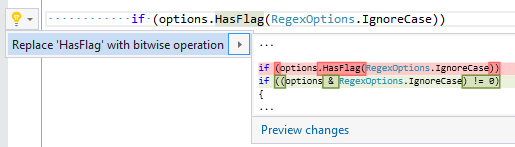

## Use bitwise operation instead of calling 'HasFlag'

| Property           | Value                                              |
| ------------------ | -------------------------------------------------- |
| Id                 | RR0164                                             |
| Title              | Use bitwise operation instead of calling 'HasFlag' |
| Syntax             | Enum\.HasFlag method invocation                    |
| Enabled by Default | &#x2713;                                           |

### Usage

## See Also

* [Full list of refactorings](Refactorings.md)

*\(Generated with [DotMarkdown](http://github.com/JosefPihrt/DotMarkdown)\)*