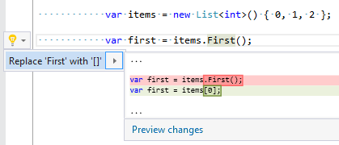

## Use element access instead of 'First/Last'ElementAt' method

Property | Value
--- | ---
Id|RR0167
Title|Use element access instead of 'First/Last'ElementAt' method
Syntax|First/Last/ElementAt method invocation
Span|method name
Enabled by Default|yes

### Usage

[full list of refactorings](Refactorings.md)