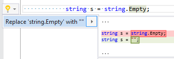

## Use "" instead of string\.Empty

| Property           | Value                           |
| ------------------ | ------------------------------- |
| Id                 | RR0168                          |
| Title              | Use "" instead of string\.Empty |
| Syntax             | string\.Empty field             |
| Enabled by Default | &#x2713;                        |

### Usage

[full list of refactorings](Refactorings.md)

*\(Generated with [DotMarkdown](http://github.com/JosefPihrt/DotMarkdown)\)*