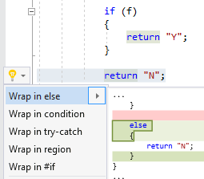

## Wrap in else clause

| Property           | Value               |
| ------------------ | ------------------- |
| Id                 | RR0173              |
| Title              | Wrap in else clause |
| Syntax             | statement           |
| Enabled by Default | &#x2713;            |

### Usage

[full list of refactorings](Refactorings.md)
*\(Generated with [DotMarkdown](http://github.com/JosefPihrt/DotMarkdown)\)*