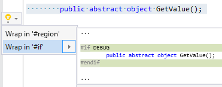

## Wrap in \#if directive

| Property           | Value                  |
| ------------------ | ---------------------- |
| Id                 | RR0174                 |
| Title              | Wrap in \#if directive |
| Syntax             | selected lines         |
| Enabled by Default | &#x2713;               |

### Usage

## See Also

* [Full list of refactorings](Refactorings.md)

*\(Generated with [DotMarkdown](http://github.com/JosefPihrt/DotMarkdown)\)*