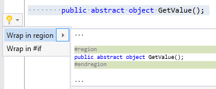

## Wrap in region

| Property           | Value          |
| ------------------ | -------------- |
| Id                 | RR0175         |
| Title              | Wrap in region |
| Syntax             | selected lines |
| Enabled by Default | &#x2713;       |

### Usage

## See Also

* [Full list of refactorings](Refactorings.md)

*\(Generated with [DotMarkdown](http://github.com/JosefPihrt/DotMarkdown)\)*