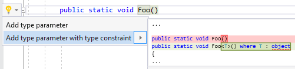

## Add type parameter

Property | Value
--- | ---
Id|RR0178
Title|Add type parameter
Syntax|class declaration, struct declaration, interface declaration, delegate declaration, method declaration, local function
Enabled by Default|yes

### Usage

[full list of refactorings](Refactorings.md)