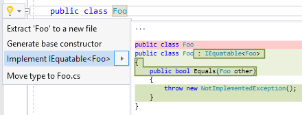

## Implement IEquatable\<T>

| Property           | Value                                                        |
| ------------------ | ------------------------------------------------------------ |
| Id                 | RR0179                                                       |
| Title              | Implement IEquatable\<T>                                     |
| Syntax             | class declaration, struct declaration, interface declaration |
| Span               | base list                                                    |
| Enabled by Default | &#x2713;                                                     |

### Usage

[full list of refactorings](Refactorings.md)
*\(Generated with [DotMarkdown](http://github.com/JosefPihrt/DotMarkdown)\)*