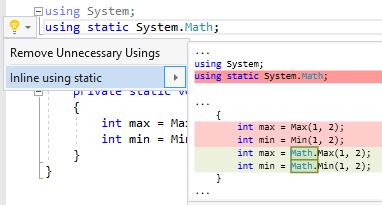

## Inline using static

| Property           | Value                  |
| ------------------ | ---------------------- |
| Id                 | RR0180                 |
| Title              | Inline using static    |
| Syntax             | using static directive |
| Enabled by Default | &#x2713;               |

### Usage

[full list of refactorings](Refactorings.md)
*\(Generated with [DotMarkdown](http://github.com/JosefPihrt/DotMarkdown)\)*