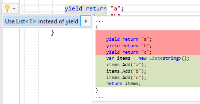

## Use List\<T> instead of yield

| Property           | Value                         |
| ------------------ | ----------------------------- |
| Id                 | RR0183                        |
| Title              | Use List\<T> instead of yield |
| Syntax             | yield return, yield break     |
| Enabled by Default | &#x2713;                      |

### Usage

## See Also

* [Full list of refactorings](Refactorings.md)

*\(Generated with [DotMarkdown](http://github.com/JosefPihrt/DotMarkdown)\)*