## Roslynator Refactorings

#### Add all properties to initializer \(RR0216\)

* **Syntax**: object/record initializer

#### Before

```csharp
class C
{
  public string P1 { get; set; }
  public string P2 { get; set; }

  void M()
  {
      var x = new C() { };
  }
}
```

#### After

```csharp
class C
{
  public string P1 { get; set; }
  public string P2 { get; set; }

  void M()
  {
      var x = new C() { P1 = , P2 = };
  }
}
```

#### Add argument name \(RR0011\)

* **Syntax**: argument list


#### Add braces \(RR0002\)

* **Syntax**: do statement, else clause, fixed statement, for statement, foreach statement, if statement, lock statement, using statement, while statement
* **Span**: embedded statement


#### Add braces to if\-else \(RR0003\)

* **Syntax**: if\-else chain
* **Span**: embedded statement
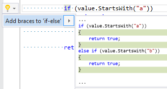

#### Add braces to switch section \(RR0004\)

* **Syntax**: switch section
* **Span**: case or default keyword


#### Add braces to switch sections \(RR0005\)

* **Syntax**: switch statement
* **Span**: case or default keyword
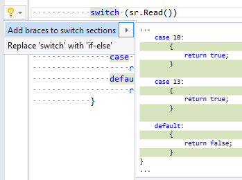

#### Add default value to parameter \(RR0007\)

* **Syntax**: parameter without default value
* **Span**: identifier


#### Add default value to return statement \(RR0008\)

* **Syntax**: return statement without expression


#### Add empty line between declarations \(RR0205\)

* **Syntax**: selected declarations

#### Before

```csharp
private object x;
private object y;
private object z;
```

#### After

```csharp
private object x;

private object y;

private object z;
```

#### Add 'exception' element to documentation comment \(RR0009\)

* **Syntax**: throw statement


#### Add explicit cast \(RR0006\)

* **Syntax**: argument, assignment expression, return statement, variable declaration


#### Add generic parameter to a declaration \(RR0178\)

* **Syntax**: class declaration, struct declaration, interface declaration, delegate declaration, method declaration, local function


#### Add identifier to parameter \(RR0012\)

* **Syntax**: parameter
* **Span**: missing identifier


#### Add identifier to variable declaration \(RR0010\)

* **Syntax**: variable declaration


#### Add member to interface \(RR0195\)

* **Syntax**: method, property, indexer, event
* **Span**: identifier

#### Before

```csharp
public class Foo : IFoo
{
    public void Bar()
    {
    }
}

public interface IFoo
{
}
```

#### After

```csharp
public class Foo : IFoo
{
    public void Bar()
    {
    }
}

public interface IFoo
{
    void Bar();
}
```

#### Add missing cases to switch statement \(RR0059\)

* **Syntax**: switch statement

#### Before

```csharp
switch (dayOfWeek)
{
    case DayOfWeek.Sunday:
        break;
    case DayOfWeek.Monday:
        break;
    case DayOfWeek.Tuesday:
        break;
    case DayOfWeek.Wednesday:
        break;
    case DayOfWeek.Thursday:
        break;
}
```

#### After

```csharp
switch (dayOfWeek)
{
    case DayOfWeek.Sunday:
        break;
    case DayOfWeek.Monday:
        break;
    case DayOfWeek.Tuesday:
        break;
    case DayOfWeek.Wednesday:
        break;
    case DayOfWeek.Thursday:
        break;
    case DayOfWeek.Friday:
        break;
    case DayOfWeek.Saturday:
        break;
}
```

#### Add parameter to interface member \(RR0213\)

* **Syntax**: method declaration, indexer declaration
* **Span**: method name or 'this' keyword

#### Before

```csharp
interface IFoo
{
    void Bar(object p);
}

class Foo : IFoo
{
    public void Bar(object p, object p2)
    {
    }
}
```

#### After

```csharp
interface IFoo
{
    void Bar(object p, object p2);
}

class Foo : IFoo
{
    public void Bar(object p, object p2)
    {
    }
}
```

#### Add tag to documentation comment \(RR0208\)

* **Syntax**: selected word\(s\) in documentation comment

#### Before

```csharp
/// <summary>
/// null
/// </summary>
public class Foo
{
}
```

#### After

```csharp
/// <summary>
/// <c>null</c>
/// </summary>
public class Foo
{
}
```

#### Add using directive \(RR0013\)

* **Syntax**: qualified name
* **Span**: selected namespace


#### Add using static directive \(RR0014\)

* **Syntax**: member access expression \(public or internal static class\)
* **Span**: selected class name


#### Call 'ConfigureAwait\(false\)' \(RR0015\)

* **Syntax**: awaitable method invocation
* **Span**: method name


#### Call extension method as instance method \(RR0016\)

* **Syntax**: method invocation


#### Call string\.IndexOf instead of string\.Contains \(RR0144\)

* **Syntax**: method invocation
* **Span**: method name

#### Before

```csharp
if (s.Contains("a"))
{
{
```

#### After

```csharp
if (s.IndexOf("a", StringComparison.OrdinalIgnoreCase) != -1)
{
{
```

#### Call 'To\.\.\.' method \(ToString, ToArray, ToList\) \(RR0017\)

* **Syntax**: argument, assignment expression, return statement, variable declaration


#### Change accessibility \(RR0186\)

* **Syntax**: access modifier
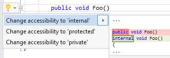

#### Change method return type to 'void' \(RR0021\)

* **Syntax**: method, local function


#### Change method/property/indexer type according to return expression \(RR0019\)

* **Syntax**: return statement in method/property/indexer


#### Change method/property/indexer type according to yield return expression \(RR0020\)

* **Syntax**: yield return statement in method/property/indexer
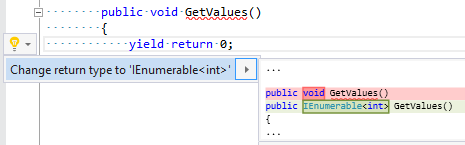

#### Change type according to expression \(RR0022\)

* **Syntax**: variable declaration, foreach statement
* **Span**: type

#### Before

```csharp
IEnumerable<object> items = new List<object>();
```

#### After

```csharp
List<object> items = new List<object>();
```

#### Check expression for null \(RR0024\)

* **Syntax**: local declaration \(identifier\), assignment expression \(left\)
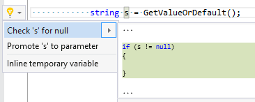

#### Check parameter for null \(RR0025\)

* **Syntax**: parameter
* **Span**: parameter identifier
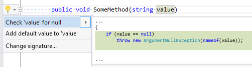

#### Comment out member declaration \(RR0027\)

* **Syntax**: method, constructor, property, indexer, operator, event, namespace, class, struct, interface
* **Span**: opening or closing brace


#### Comment out statement \(RR0028\)

* **Syntax**: do statement, fixed statement, for statement, foreach statement, checked statement, if statement, lock statement, switch statement, try statement, unchecked statement, unsafe statement, using statement, while statement
* **Span**: opening or closing brace
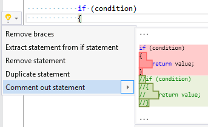

#### Convert "" to string\.Empty \(RR0171\)

* **Syntax**: empty string literal


#### Convert ?: to if\-else \(RR0120\)

* **Syntax**: ?: operator that is part of local declaration, assignment or \(yield\) return statement

#### Before

```csharp
string s = (x) ? "a" : "b";
```

#### After

```csharp
string s;
if (x)
{
    s = "a";
}
else
{
    s = "b";
}
```

- - -

#### Before

```csharp
string s = (x) ? "a" : (y) ? "b" : "c";
```

#### After

```csharp
string s;
if (x)
{
    s = "a";
}
else if (y)
{
    s = "b";
}
else
{
    s = "c";
}
```

#### Convert auto\-property to full property \(RR0041\)

* **Syntax**: auto\-property


#### Convert auto\-property to full property \(without backing field\) \(RR0040\)

* **Syntax**: auto\-property


#### Convert block body to expression body \(RR0169\)

* **Syntax**: method, property, indexer, operator
* **Span**: body or accessor list


#### Convert comment to documentation comment \(RR0192\)

* **Syntax**: single\-line comment

#### Before

```csharp
// comment
public class Foo
{
}
```

#### After

```csharp
/// <summary>
/// comment
/// </summary>
public class Foo
{
}
```

#### Convert 'do' to 'while' \(RR0123\)

* **Syntax**: do statement
* **Span**: do keyword

#### Before

```csharp
do
{
} while (condition);
```

#### After

```csharp
while (condition)
{
}
```

#### Convert expression body to block body \(RR0037\)

* **Syntax**: expression body


#### Convert 'for' to 'foreach' \(RR0130\)

* **Syntax**: for statement
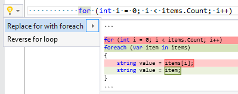

#### Convert 'for' to 'while' \(RR0131\)

* **Syntax**: for statement
* **Span**: for keyword or selected for statement
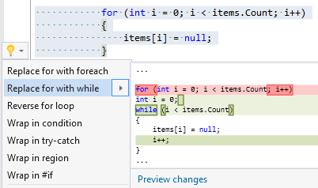

#### Convert 'foreach' to 'for' \(RR0129\)

* **Syntax**: foreach statement
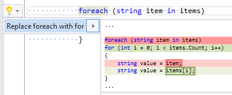

#### Convert 'foreach' to 'for' and reverse loop \(RR0188\)

* **Syntax**: foreach statement

#### Before

```csharp
foreach (object item in items)
{
    yield return item;
}
```

#### After

```csharp
for (int i = items.Count - 1; i >= 0; i--)
{
    yield return items[i];
}
```

#### Convert 'HasFlag' call to bitwise operation \(RR0164\)

* **Syntax**: Enum\.HasFlag method invocation


#### Convert hexadecimal literal to decimal literal \(RR0132\)

* **Syntax**: hexadecimal literal
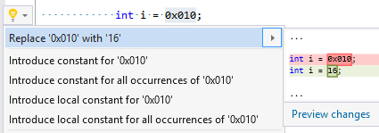

#### Convert 'if' to ?: \(RR0166\)

* **Syntax**: if statement
* **Span**: top if keyword or selected if statement


#### Convert 'if' to 'switch' \(RR0133\)

* **Syntax**: if statement
* **Span**: top if keyword or selected if statement

#### Before

```csharp
var ch = stringReader.Read();

if (ch == 10 || ch == 13)
{
    return;
}
else
{
    stringBuilder.Append(ch);
}
```

#### After

```csharp
var ch = stringReader.Read();

switch (ch)
{
    case 10:
    case 13:
        {
            return;
        }

    default:
        {
            stringBuilder.Append(ch);
            break;
        }
}
```

#### Convert interpolated string to concatenation \(RR0193\)

* **Syntax**: interpolated string

#### Before

```csharp
string s = $"a{b}c";
```

#### After

```csharp
string s = "a" + b + "c";
```

#### Convert interpolated string to string literal \(RR0136\)

* **Syntax**: Interpolated string without any interpolation
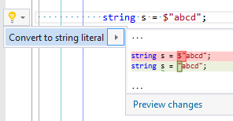

#### Convert interpolated string to 'string\.Format' \(RR0201\)

* **Syntax**: interpolated string

#### Before

```csharp
$"name: {name,0:f}, value: {value}"
```

#### After

```csharp
string.Format("name: {0,0:f} value: {1}", name, value)
```

#### Convert lambda block body to expression body \(RR0154\)

* **Syntax**: lambda expression with block body with single single\-line statement
* **Span**: body


#### Convert lambda expression body to block body \(RR0039\)

* **Syntax**: lambda expression's expression body
* **Span**: body
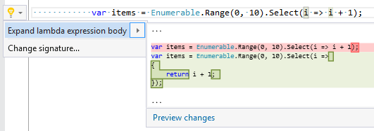

#### Convert method group to lambda \(RR0137\)

* **Syntax**: method group

#### Before

```csharp
Func<object, object, object> func = Foo;
```

#### After

```csharp
Func<object, object, object> func = (f, g) => Foo(f, g)
```

#### Convert regular string literal to verbatim string literal \(RR0142\)

* **Syntax**: regular string literal
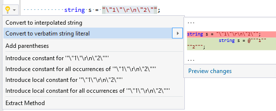

#### Convert 'return' statement to 'if' \(RR0143\)

* **Syntax**: return statement, yield return statement
* **Span**: selected statement, yield keyword or return keyword


#### Convert statements to if\-else \(RR0211\)

* **Syntax**: selected statements \(first statement must be 'if' statement\)

#### Before

```csharp
if (x)
    return 1;

if (y)
{
    return 2;
}
else if (z)
{
    return 3;
}

return 0;
```

#### After

```csharp
if (x)
{
    return 1;
}
else if (y)
{
    return 2;
}
else if (z)
{
    return 3;
}
else
{
    return 0;
}
```

#### Convert 'string\.Format' to interpolated string \(RR0145\)

* **Syntax**: string\.Format method
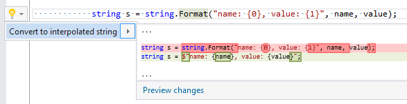

#### Convert 'switch' expression to 'switch' statement \(RR0214\)

* **Syntax**: switch expression
* **Span**: switch keyword

#### Before

```csharp
return dayOfWeek switch
{
    DayOfWeek.Monday => 1,
    DayOfWeek.Tuesday => 2,
    DayOfWeek.Wednesday => 3,
    DayOfWeek.Thursday => 4,
    DayOfWeek.Friday => 5,
    _ => throw new Exception(),
};
```

#### After

```csharp
switch (dayOfWeek)
{
    case DayOfWeek.Monday:
        return 1;
    case DayOfWeek.Tuesday:
        return 2;
    case DayOfWeek.Wednesday:
        return 3;
    case DayOfWeek.Thursday:
        return 4;
    case DayOfWeek.Friday:
        return 5;
    default:
        throw new Exception();
}
```

#### Convert 'switch' to 'if' \(RR0147\)

* **Syntax**: switch statement
* **Span**: switch keyword


#### Convert verbatim string literal to regular string literal \(RR0148\)

* **Syntax**: verbatim string literal
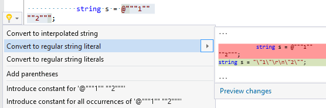

#### Convert verbatim string literal to regular string literals \(RR0149\)

* **Syntax**: multiline verbatim string literal
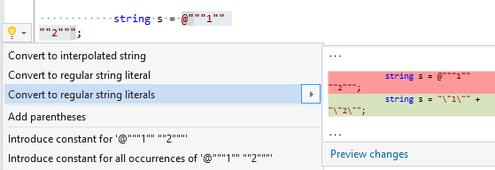

#### Convert 'while' statement to 'do' statement \(RR0150\)

* **Syntax**: while statement
* **Span**: while keyword

#### Before

```csharp
while (condition)
{
}
```

#### After

```csharp
if (condition)
{
  do
  {
  } while (condition);
}
```

#### Convert 'while' statement to 'for' statement \(RR0151\)

* **Syntax**: while statement
* **Span**: while keyword or selected statement\(s\)
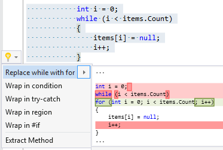

#### Copy argument \(RR0030\)

* **Syntax**: missing argument


#### Copy documentation comment from base member \(RR0029\)

* **Syntax**: constructor, method, property, indexer, event
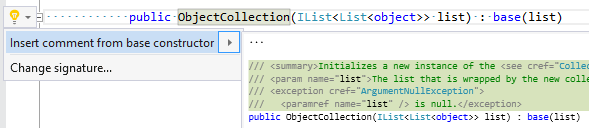

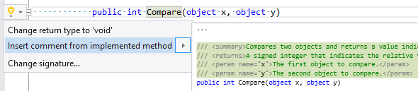

#### Copy member declaration \(RR0031\)

* **Syntax**: method, constructor, property, indexer, operator, event, namespace, class, struct, interface
* **Span**: opening or closing brace


#### Copy parameter \(RR0032\)

* **Syntax**: missing parameter


#### Copy statement \(RR0033\)

* **Syntax**: do statement, fixed statement, for statement, foreach statement, checked statement, if statement, lock statement, switch statement, try statement, unchecked statement, unsafe statement, using statement, while statement
* **Span**: opening or closing brace


#### Copy switch section \(RR0212\)

* **Syntax**: switch section
* **Span**: close brace or empty line after switch section

#### Before

```csharp
switch (s)
{
    case "a":
        {
            // ...

            break;
        }
    default:
        {
            break;
        }
}
```

#### After

```csharp
switch (s)
{
    case "a":
        {
            // ...

            break;
        }
    case "a":
        {
            // ...

            break;
        }
    default:
        {
            break;
        }
}
```

#### Expand coalesce expression \(RR0035\)

* **Syntax**: coalesce expression
* **Span**: ?? operator


#### Expand compound assignment \(RR0034\)

* **Syntax**: compound assignment expression
* **Span**: operator


#### Expand event declaration \(RR0036\)

* **Syntax**: event field declaration


#### Expand initializer \(RR0038\)

* **Syntax**: initializer
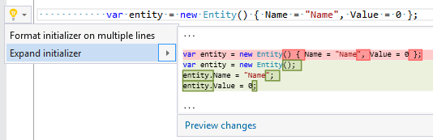

#### Expand positional constructor \(RR0215\)

* **Syntax**: positional record
* **Span**: parameter list

#### Before

```csharp
public record Foo([property: Obsolete] string Value1, string Value2);
```

#### After

```csharp
public record Foo
{
    public Foo(string value1, string value2)
    {
        Value1 = value1;
        Value2 = value2;
    }

    [Obsolete]
    public string Value1 { get; init; }
    public string Value2 { get; init; }
}
```

#### Extract event handler method \(RR0203\)

* **Syntax**: lambda expression

#### Before

```csharp
void Foo()
{
  x.Changed += (s, e) => Bar();
}
```

#### After

```csharp
void Foo()
{
  x.Changed += Changed;
}

void OnChanged(object sender, EventArgs e)
{
  Bar();
}
```

#### Extract expression from condition \(RR0043\)

* **Syntax**: if statement, while statement
* **Span**: condition

#### Before

```csharp
if (x && y) // Select 'y'
{
}
```

#### After

```csharp
if(x)
{
    if (y)
    {
    }
}
```

- - -

#### Before

```csharp
if (x || y) // Select 'y'
{
}
```

#### After

```csharp
if(x)
{
}

if (y)
{
}
```

#### Extract generic type \(RR0044\)

* **Syntax**: generic name with single type argument
* **Span**: type argument


#### Extract type declaration to a new file \(RR0046\)

* **Syntax**: class declaration, struct declaration, interface declaration, enum declaration, delegate declaration
* **Span**: identifier


#### Format accessor braces \(RR0047\)

* **Syntax**: get accessor, set accessor, add accessor, remove accessor
* **Span**: block


#### Generate base constructors \(RR0054\)

* **Syntax**: class declaration
* **Span**: identifier


#### Generate combined enum member \(RR0055\)

* **Syntax**: enum declaration \(with FlagsAttribute\)


#### Generate enum member \(RR0056\)

* **Syntax**: enum declaration \(with FlagsAttribute\)
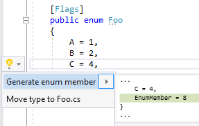

#### Generate enum values \(RR0057\)

* **Syntax**: enum declaration \(with FlagsAttribute\)


#### Generate event invoking method \(RR0058\)

* **Syntax**: event
* **Span**: identifier
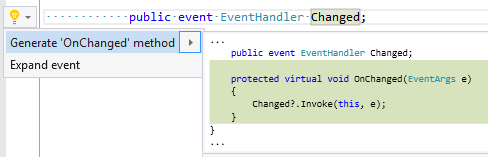

#### Generate property for DebuggerDisplay attribute \(RR0204\)

* **Syntax**: DebuggerDisplay attribute

#### Before

```csharp
[DebuggerDisplay("A: {A} B: {B}")]
public class Foo
{
    public string A { get; }
    public string B { get; }
}
```

#### After

```csharp
DebuggerDisplay("{DebuggerDisplay,nq}")]
public class Foo
{
    public string A { get; }
    public string B { get; }

    [DebuggerBrowsable(DebuggerBrowsableState.Never)]
    private string DebuggerDisplay
    {
        get { return $"A: {A} B: {B}"; }
    }
}
```

#### Implement custom enumerator \(RR0210\)

* **Syntax**: class that implements IEnumerable\<T>
* **Span**: identifier

#### Before

```csharp
using System;
using System.Collections;
using System.Collections.Generic;

class C<T> : IEnumerable<T>
{
    IEnumerator<T> IEnumerable<T>.GetEnumerator()
    {
        throw new NotImplementedException();
    }

    IEnumerator IEnumerable.GetEnumerator()
    {
        throw new NotImplementedException();
    }
}
```

#### After

```csharp
using System;
using System.Collections;
using System.Collections.Generic;

class C<T> : IEnumerable<T>
{
    IEnumerator<T> IEnumerable<T>.GetEnumerator()
    {
        throw new NotImplementedException();
    }

    IEnumerator IEnumerable.GetEnumerator()
    {
        throw new NotImplementedException();
    }

    public Enumerator GetEnumerator()
    {
        return new Enumerator(this);
    }

    public struct Enumerator
    {
        private readonly C<T> _c;
        private int _index;

        internal Enumerator(C<T> c)
        {
            _c = c;
            _index = -1;
        }

        public T Current
        {
            get
            {
                throw new NotImplementedException();
            }
        }

        public bool MoveNext()
        {
            throw new NotImplementedException();
        }

        public void Reset()
        {
            _index = -1;
            throw new NotImplementedException();
        }

        public override bool Equals(object obj)
        {
            throw new NotSupportedException();
        }

        public override int GetHashCode()
        {
            throw new NotSupportedException();
        }
    }

    //TODO: IEnumerable.GetEnumerator() and IEnumerable<T>.GetEnumerator() should return instance of EnumeratorImpl.
    private class EnumeratorImpl : IEnumerator<T>
    {
        private Enumerator _e;

        internal EnumeratorImpl(C<T> c)
        {
            _e = new Enumerator(c);
        }

        public T Current
        {
            get
            {
                return _e.Current;
            }
        }

        object IEnumerator.Current
        {
            get
            {
                return _e.Current;
            }
        }

        public bool MoveNext()
        {
            return _e.MoveNext();
        }

        void IEnumerator.Reset()
        {
            _e.Reset();
        }

        void IDisposable.Dispose()
        {
        }
    }
}
```

#### Implement IEquatable\<T> \(RR0179\)

* **Syntax**: class declaration, struct declaration, interface declaration
* **Span**: base list


#### Initialize field from constructor \(RR0197\)

* **Syntax**: field declaration
* **Span**: identifier

#### Before

```csharp
public class Foo
{
    private string _bar;

    public Foo()
    {
    }

    public Foo(object parameter)
    {
    }

    public Foo(object parameter1, object parameter2)
        : this(parameter1)
    {
    }
}
```

#### After

```csharp
public class Foo
{
    private string _bar;

    public Foo(string bar)
    {
        _bar = bar;
    }

    public Foo(object parameter, string bar)
    {
        _bar = bar;
    }

    public Foo(object parameter1, object parameter2, string bar)
        : this(parameter1, bar)
    {
        _bar = bar;
    }
}
```

#### Initialize local variable with default value \(RR0060\)

* **Syntax**: local declaration without initializer
* **Span**: identifier


#### Inline alias expression \(RR0061\)

* **Syntax**: using alias directive
* **Span**: identifier


#### Inline constant declaration \(RR0181\)

* **Syntax**: constant declaration


#### Inline constant value \(RR0127\)

* **Syntax**: expression that has constant value

#### Before

```csharp
public const string Value = "x";

void Foo()
{
    string x = Value;
}
```

#### After

```csharp
public const string Value = "x";

void Foo()
{
    string x = "x";
}
```

#### Inline method \(RR0062\)

* **Syntax**: method invocation


#### Inline property \(RR0198\)

* **Syntax**: property access


#### Inline using static directive \(RR0180\)

* **Syntax**: using static directive


#### Insert string interpolation \(RR0063\)

* **Syntax**: string literal, interpolated string
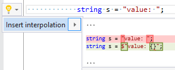

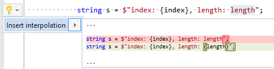

#### Introduce and initialize field \(RR0064\)

* **Syntax**: constructor parameter


#### Introduce and initialize property \(RR0065\)

* **Syntax**: constructor parameter


#### Introduce constructor \(RR0066\)

* **Syntax**: field, property


#### Introduce field to lock on \(RR0067\)

* **Syntax**: lock statement
* **Span**: missing expression


#### Introduce local variable \(RR0068\)

* **Syntax**: expression statement, expression in using statement


#### Invert binary expression \(RR0079\)

* **Syntax**: logical and/or expression


#### Invert boolean literal \(RR0080\)

* **Syntax**: boolean literal


#### Invert conditional expression \(RR0160\)

* **Syntax**: conditional expression
* **Span**: condition


#### Invert if \(RR0189\)

* **Syntax**: if statement
* **Span**: if keyword

#### Before

```csharp
if (condition1)
{
    if (condition2)
    {
        Foo();
    }
}
```

#### After

```csharp
if (!condition1)
{
    return;
}

if (!condition2)
{
    return;
}

Foo();
```

- - -

#### Before

```csharp
if (!condition1)
{
    return;
}

if (!condition2)
{
    return;
}

Foo();
```

#### After

```csharp
if (condition1)
{
    if (condition2)
    {
        Foo();
    }
}
```

#### Invert if\-else \(RR0162\)

* **Syntax**: if\-else statement
* **Span**: if keyword


#### Invert is expression \(RR0081\)

* **Syntax**: is expression
* **Span**: operator


#### Invert LINQ method call \(RR0116\)

* **Syntax**: System\.Linq\.Enumerable\.Any\(Func\<T, bool>\) or System\.Linq\.Enumerable\.All\(Func\<T, bool>\)
* **Span**: method name

#### Before

```csharp
if (items.Any(predicate))
{
}
```

#### After

```csharp
if (items.All(!predicate))
{
}
```

- - -

#### Before

```csharp
if (items.All(predicate))
{
}
```

#### After

```csharp
if (items.Any(!predicate))
{
}
```

#### Invert operator \(RR0082\)

* **Syntax**: \!=, &&, \|\|, \<, \<=, ==, >, >=


#### Invert prefix/postfix unary operator \(RR0134\)

* **Syntax**: prefix/postfix unary expression
* **Span**: operator token

#### Before

```csharp
int i = 0;

i++;
```

#### After

```csharp
int i = 0;

i--;
```

- - -

#### Before

```csharp
int i = 0;

++i;
```

#### After

```csharp
int i = 0;

--i;
```

#### Join string expressions \(RR0078\)

* **Syntax**: concatenated string expressions


#### Make member abstract \(RR0069\)

* **Syntax**: non\-abstract indexer/method/property in abstract class
* **Span**: indexer/method/property header


#### Make member virtual \(RR0070\)

* **Syntax**: method declaration, indexer declaration


#### Merge attributes \(RR0074\)

* **Syntax**: selected attribute lists
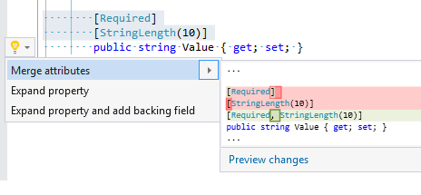

#### Merge 'if' statements \(RR0075\)

* **Syntax**: selected 'if' statements

#### Before

```csharp
if (x)
{
    return false;
}

if (y)
{
    return false;
}

return true;
```

#### After

```csharp
if (x || y)
{
    return false;
}

return true;
```

#### Merge if with parent if \(RR0196\)

* **Syntax**: if statement
* **Span**: if keyword

#### Before

```csharp
if (x)
{
    if (y)
    {
    }
}
else
{
}
```

#### After

```csharp
if (x && y)
{
}
else
{
}
```

#### Merge interpolation into interpolated string \(RR0076\)

* **Syntax**: interpolation
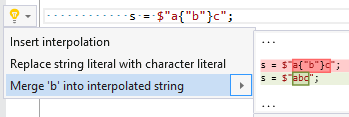

#### Merge local declarations \(RR0077\)

* **Syntax**: local declarations with same type


#### Merge switch sections \(RR0110\)

* **Syntax**: selected switch sections


#### Move unsafe context to containing declaration \(RR0202\)

* **Syntax**: unsafe declaration
* **Span**: unsafe modifier

#### Before

```csharp
public class Foo
{
  public unsafe void Bar()
  {
  }
}
```

#### After

```csharp
public unsafe class Foo
{
  public void Bar()
  {
  }
}
```

#### Notify when property changes \(RR0083\)

* **Syntax**: property in class/struct that implements System\.ComponentModel\.INotifyPropertyChanged
* **Span**: setter


#### Parenthesize expression \(RR0084\)

* **Syntax**: selected expression


#### Promote local variable to parameter \(RR0085\)

* **Syntax**: local declaration in method


#### Remove all comments \(RR0086\)

* **Syntax**: singleline/multiline comment, singleline/multiline documentation documentation comment


#### Remove all comments \(except documentation comments\) \(RR0087\)

* **Syntax**: singleline/multiline comment


#### Remove all documentation comments \(RR0088\)

* **Syntax**: singleline/multiline documentation comment
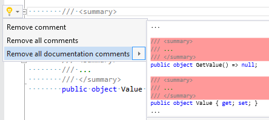

#### Remove all member declarations \(RR0089\)

* **Syntax**: namespace, class, struct, interface
* **Span**: opening or closing brace


#### Remove all preprocessor directives \(RR0090\)

* **Syntax**: preprocessor directive


#### Remove all region directives \(RR0091\)

* **Syntax**: region directive


#### Remove all statements \(RR0092\)

* **Syntax**: method, constructor, operator
* **Span**: opening or closing brace


#### Remove all switch sections \(RR0093\)

* **Syntax**: switch statement
* **Span**: opening or closing brace


#### Remove argument name \(RR0105\)

* **Syntax**: selected argument\(s\)


#### Remove async/await \(RR0209\)

* **Syntax**: method declaration, local function, lambda, anonymous method
* **Span**: async keyword

#### Before

```csharp
class C
{
    async Task<object> FooAsync()
    {
        return await BarAsync().ConfigureAwait(false);
    }
}
```

#### After

```csharp
class C
{
    Task<object> FooAsync()
    {
        return BarAsync();
    }
}
```

#### Remove braces \(RR0094\)

* **Syntax**: do statement, else clause, fixed statement, for statement, foreach statement, if statement, lock statement, using statement, while statement
* **Span**: block with a single statement


#### Remove braces from if\-else \(RR0095\)

* **Syntax**: if\-else chain
* **Span**: embedded statement


#### Remove braces from switch section \(RR0096\)

* **Syntax**: switch section
* **Span**: case or default keyword


#### Remove braces from switch sections \(RR0097\)

* **Syntax**: switch statement
* **Span**: case or default keyword


#### Remove comment \(RR0098\)

* **Syntax**: singleline/multiline comment, singleline/multiline xml documentation comment


#### Remove condition from last else clause \(RR0099\)

* **Syntax**: else clause
* **Span**: else keyword


#### Remove containing statement \(RR0045\)

* **Syntax**: else clause, fixed statement, for statement, foreach statement, checked statement, if statement, lock statement, try statement, unsafe statement, using statement, while statement


#### Remove empty lines \(RR0101\)

* **Syntax**: selected lines


#### Remove enum member value\(s\) \(RR0199\)

* **Syntax**: selected enum member\(s\)

#### Before

```csharp
public enum Foo
{
    One = 1,
    Two = 2,
    Three = 3
}
```

#### After

```csharp
public enum Foo
{
    One,
    Two,
    Three
}
```

#### Remove instantiation of a local variable \(RR0185\)

* **Syntax**: local variable with a new object creation

#### Before

```csharp
var x = new object();
```

#### After

```csharp
object x = null;
```

- - -

#### Before

```csharp
var arr = new object[0];
```

#### After

```csharp
object[] arr = null;
```

#### Remove interpolation \(RR0102\)

* **Syntax**: string interpolation
* **Span**: opening or closing brace


#### Remove member declaration \(RR0103\)

* **Syntax**: method, constructor, property, indexer, operator, event, namespace, class, struct, interface
* **Span**: opening or closing brace


#### Remove member declarations above/below \(RR0104\)

* **Syntax**: empty line between member declarations
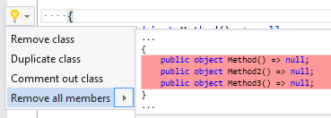

#### Remove parentheses \(RR0106\)

* **Syntax**: parenthesized expression
* **Span**: opening or closing parenthesis


#### Remove preprocessor directive \(RR0100\)

* **Syntax**: \#if directive, \#region directive


#### Remove property initializer \(RR0107\)

* **Syntax**: property initializer


#### Remove region \(RR0108\)

* **Syntax**: region directive


#### Remove statement \(RR0109\)

* **Syntax**: do statement, fixed statement, for statement, foreach statement, checked statement, if statement, lock statement, switch statement, try statement, unchecked statement, unsafe statement, using statement, while statement
* **Span**: open/close brace


#### Remove unnecessary assignment \(RR0073\)

* **Syntax**: assignment expression followed with return statement


#### Rename identifier according to type name \(RR0112\)

* **Syntax**: foreach statement, local/field/constant declaration
* **Span**: identifier


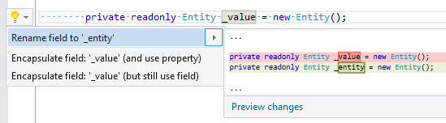

#### Rename method according to type name \(RR0113\)

* **Syntax**: method
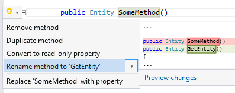

#### Rename parameter according to its type name \(RR0114\)

* **Syntax**: parameter
* **Span**: parameter identifier


#### Rename property according to type name \(RR0115\)

* **Syntax**: property identifier


#### Replace 'as' expression with explicit cast \(RR0117\)

* **Syntax**: as expression


#### Replace conditional expression with true/false branch \(RR0119\)

* **Syntax**: conditional expression
* **Span**: selected true/false expression


#### Replace equality operator with string\.Equals \(RR0124\)

* **Syntax**: equals expression, not equals expression
* **Span**: operator


#### Replace equality operator with string\.IsNullOrEmpty \(RR0125\)

* **Syntax**: equals expression, not equals expression
* **Span**: operator


#### Replace equality operator with string\.IsNullOrWhiteSpace \(RR0126\)

* **Syntax**: equals expression, not equals expression
* **Span**: operator


#### Replace explicit cast expression 'as' expression \(RR0118\)

* **Syntax**: cast expression


#### Replace interpolated string with interpolation expression \(RR0135\)

* **Syntax**: interpolated string with single interpolation and no text
* **Span**: interpolation


#### Replace method with property \(RR0138\)

* **Syntax**: method
* **Span**: method header


#### Replace 'null' with 'default\(\.\.\.\)' \(RR0139\)

* **Syntax**: argument


#### Replace prefix operator to postfix operator \(RR0140\)

* **Syntax**: prefix/postfix unary expression


#### Replace property with method \(RR0141\)

* **Syntax**: read\-only property
* **Span**: property header
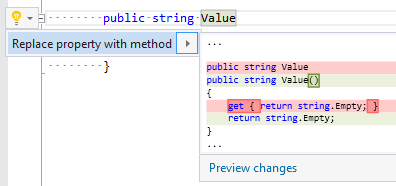

#### Reverse 'for' statement \(RR0152\)

* **Syntax**: for statement
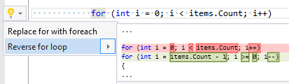

#### Simplify if \(RR0153\)

* **Syntax**: if statement
* **Span**: top if keyword or selected if statement
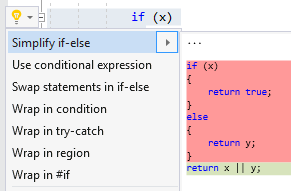

#### Sort case labels \(RR0207\)

* **Syntax**: selected case labels with string literal or enum field

#### Before

```csharp
bool Foo(string s)
{
    switch (s)
    {
        case "d":
        case "b":
        case "a":
        case "c":
            return true;
        default:
            return false;
    }
}
```

#### After

```csharp
bool Foo(string s)
{
    switch (s)
    {
        case "a":
        case "b":
        case "c":
        case "d":
            return true;
        default:
            return false;
    }
}
```

#### Sort member declarations \(RR0155\)

* **Syntax**: namespace declarations, class declarations, struct declarations, interface declarations, enum declarations
* **Span**: selected member declarations
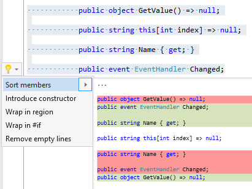

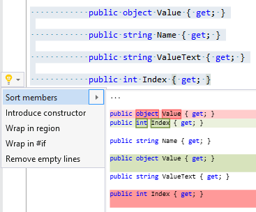

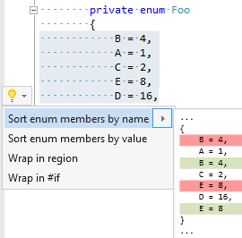

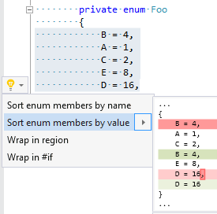

#### Split attributes \(RR0156\)

* **Syntax**: selected attribute list


#### Split declaration and initialization \(RR0194\)

* **Syntax**: local variable declaration
* **Span**: equals token

#### Before

```csharp
var s = GetValue();
```

#### After

```csharp
string s;
s = GetValue();
```

#### Split if \(RR0184\)

* **Syntax**: if statement that has 'logical or' expression as a condition
* **Span**: top if keyword or selected if statement


#### Split if\-else \(RR0190\)

* **Syntax**: if statement
* **Span**: selected if statement or topmost if keyword

#### Before

```csharp
if (condition1)
{
    return Foo1();
{
else if (condition2)
{
    return Foo2();
}
else
{
    return false;
}
```

#### After

```csharp
if (condition1)
{
    return Foo1();
{

if (condition2)
{
    return Foo2();
}

return false;
```

#### Split switch labels \(RR0157\)

* **Syntax**: selected switch labels


#### Split variable declaration \(RR0158\)

* **Syntax**: local declaration, field declaration, event field declaration
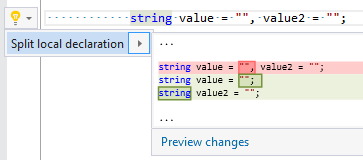

#### Swap binary operands \(RR0159\)

* **Syntax**: binary expression
* **Span**: binary operator

#### Before

```csharp
if (x && y)
{
{
```

#### After

```csharp
if (y && x)
{
{
```

#### Swap member declarations \(RR0161\)

* **Syntax**: empty line between member declarations


#### Synchronize property name and backing field name \(RR0111\)

* **Syntax**: field identifier inside property declaration


#### Uncomment multi\-line comment \(RR0200\)

* **Syntax**: multi\-line comment

#### Before

```csharp
/*string s = null;*/
```

#### After

```csharp
string s = null;
```

#### Uncomment single\-line comment \(RR0163\)

* **Syntax**: single\-line comment\(s\)


#### Use "" instead of string\.Empty \(RR0168\)

* **Syntax**: string\.Empty field


#### Use coalesce expression instead of if \(RR0165\)

* **Syntax**: if statement
* **Span**: top if keyword or selected if statement
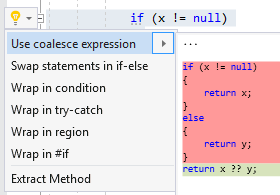

#### Use constant instead of read\-only field \(RR0128\)

* **Syntax**: read\-only field


#### Use element access instead of LINQ method \(RR0167\)

* **Syntax**: First/Last/ElementAt method invocation
* **Span**: method name


#### Use enumerator explicitly \(RR0206\)

* **Syntax**: foreach statement
* **Span**: foreach keyword

#### Before

```csharp
foreach (var item in items)
{
    yield return item;
}
```

#### After

```csharp
using (var en = items.GetEnumerator())
{
    while (en.MoveNext())
    {
        yield return item;
    }
}
```

#### Use explicit type \(RR0023\)

* **Syntax**: variable declaration, foreach statement
* **Span**: type


#### Use implicit type \(RR0018\)

* **Syntax**: variable declaration, foreach statement
* **Span**: type


#### Use index initializer \(RR0191\)

* **Syntax**: collection initializer

#### Before

```csharp
var dic = new Dictionary<int, string>() { { 0, "0" } };
```

#### After

```csharp
var dic = new Dictionary<int, string>() { [0] = "0" };
```

#### Use lambda instead of anonymous method \(RR0170\)

* **Syntax**: anonymous method
* **Span**: delegate keyword


#### Use List\<T> instead of yield \(RR0183\)

* **Syntax**: yield return, yield break


#### Use object initializer \(RR0026\)

* **Syntax**: selected statements \(object creation followed with assignment\(s\)\)


#### Use read\-only field instead of constant \(RR0121\)

* **Syntax**: constant declaration


#### Use StringBuilder instead of concatenation \(RR0182\)

* **Syntax**: string concatenation
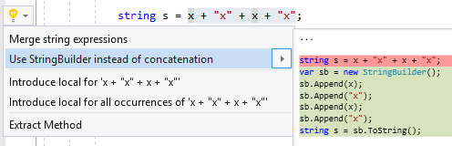

#### Wrap arguments \(RR0048\)

* **Syntax**: argument list

#### Before

```csharp
M(x, y, z);
```

#### After

```csharp
M(
    x,
    y,
    z);
```

- - -

#### Before

```csharp
void M(
    x,
    y,
    z);
```

#### After

```csharp
void M(x, y, z);
```

#### Wrap binary expression \(RR0049\)

* **Syntax**: logical and/or expression, bitwise and/or expression

#### Before

```csharp
if (x && y && z)
{
}
```

#### After

```csharp
if (x
    && y
    && z)
{
}
```

- - -

#### Before

```csharp
if (x
    && y
    && z)
{
}
```

#### After

```csharp
if (x && y && z)
{
}
```

#### Wrap call chain \(RR0051\)

* **Syntax**: call chain

#### Before

```csharp
x.M().N().O()
```

#### After

```csharp
x
    .M()
    .N()
    .O()
```

- - -

#### Before

```csharp
x
    .M()
    .N()
    .O()
```

#### After

```csharp
x.M().N().O()
```

#### Wrap conditional expression \(RR0050\)

* **Syntax**: conditional expression

#### Before

```csharp
x ? y : z
```

#### After

```csharp
x
    ? y
    : z
```

#### Wrap constraint clauses \(RR0187\)

* **Syntax**: type parameter constraint clause

#### Before

```csharp
private void Foo<T1, T2, T3>() where T1 : class where T2 : class where T3 : class
{
}
```

#### After

```csharp
private void Foo<T1, T2, T3>()
    where T1 : class
    where T2 : class
    where T3 : class
{
}
```

#### Wrap in else clause \(RR0173\)

* **Syntax**: statement


#### Wrap initializer expressions \(RR0052\)

* **Syntax**: initializer

#### Before

```csharp
var x = new string[] { "a", "b", "c" }
```

#### After

```csharp
var x = new string[]
{
    "a",
    "b",
    "c"
}
```

- - -

#### Before

```csharp
var x = new string[]
{
    "a",
    "b",
    "c"
}
```

#### After

```csharp
var x = new string[] { "a", "b", "c" }
```

#### Wrap lines in \#region directive \(RR0175\)

* **Syntax**: selected lines


#### Wrap lines in preprocessor directive \(RR0174\)

* **Syntax**: selected lines


#### Wrap lines in try\-catch \(RR0176\)

* **Syntax**: selected statements


#### Wrap parameters \(RR0053\)

* **Syntax**: parameter list

#### Before

```csharp
void M(object x, object y, object z)
{
}
```

#### After

```csharp
void M(
    object x,
    object y,
    object z)
{
}
```

- - -

#### Before

```csharp
void M(
    object x,
    object y,
    object z)
{
}
```

#### After

```csharp
void M(object x, object y, object z)
{
}
```

#### Wrap statements in condition \(RR0172\)

* **Syntax**: selected statements


#### Wrap statements in 'using' statement \(RR0177\)

* **Syntax**: selected statements where first is local declaration of type that implements IDisposable


*\(Generated with [DotMarkdown](http://github.com/JosefPihrt/DotMarkdown)\)*