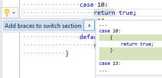

## Add braces to switch section

| Property           | Value                        |
| ------------------ | ---------------------------- |
| Id                 | RR0004                       |
| Title              | Add braces to switch section |
| Syntax             | switch section               |
| Span               | case or default keyword      |
| Enabled by Default | &#x2713;                     |

### Usage

## See Also

* [Full list of refactorings](Refactorings.md)

*\(Generated with [DotMarkdown](http://github.com/JosefPihrt/DotMarkdown)\)*