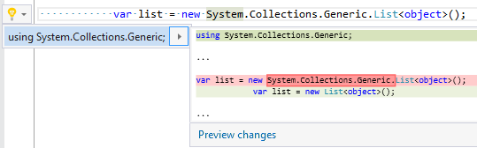

## Add using directive

| Property           | Value               |
| ------------------ | ------------------- |
| Id                 | RR0013              |
| Title              | Add using directive |
| Syntax             | qualified name      |
| Span               | selected namespace  |
| Enabled by Default | &#x2713;            |

### Usage

## See Also

* [Full list of refactorings](Refactorings.md)

*\(Generated with [DotMarkdown](http://github.com/JosefPihrt/DotMarkdown)\)*