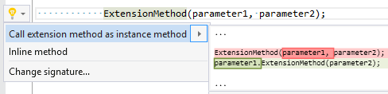

## Call extension method as instance method

| Property           | Value                                    |
| ------------------ | ---------------------------------------- |
| Id                 | RR0016                                   |
| Title              | Call extension method as instance method |
| Syntax             | method invocation                        |
| Enabled by Default | &#x2713;                                 |

### Usage

## See Also

* [Full list of refactorings](Refactorings.md)

*\(Generated with [DotMarkdown](http://github.com/JosefPihrt/DotMarkdown)\)*