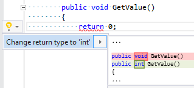

## Change method/property/indexer type according to return expression

| Property           | Value                                                              |
| ------------------ | ------------------------------------------------------------------ |
| Id                 | RR0019                                                             |
| Title              | Change method/property/indexer type according to return expression |
| Syntax             | return statement in method/property/indexer                        |
| Enabled by Default | &#x2713;                                                           |

### Usage

## See Also

* [Full list of refactorings](Refactorings.md)

*\(Generated with [DotMarkdown](http://github.com/JosefPihrt/DotMarkdown)\)*