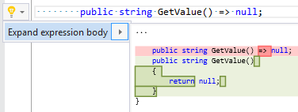

## Convert expression body to block body

| Property           | Value                                 |
| ------------------ | ------------------------------------- |
| Id                 | RR0037                                |
| Title              | Convert expression body to block body |
| Syntax             | expression body                       |
| Enabled by Default | &#x2713;                              |

### Usage

## See Also

* [Full list of refactorings](Refactorings.md)

*\(Generated with [DotMarkdown](http://github.com/JosefPihrt/DotMarkdown)\)*