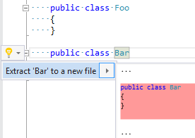

## Extract type declaration to a new file

| Property           | Value                                                                                                |
| ------------------ | ---------------------------------------------------------------------------------------------------- |
| Id                 | RR0046                                                                                               |
| Title              | Extract type declaration to a new file                                                               |
| Syntax             | class declaration, struct declaration, interface declaration, enum declaration, delegate declaration |
| Span               | identifier                                                                                           |
| Enabled by Default | &#x2713;                                                                                             |

### Usage

## See Also

* [Full list of refactorings](Refactorings.md)

*\(Generated with [DotMarkdown](http://github.com/JosefPihrt/DotMarkdown)\)*