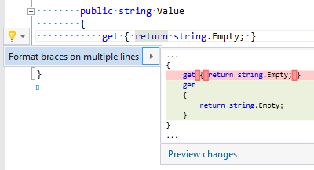
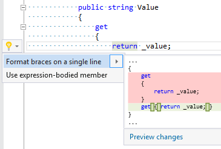

## Format accessor braces

| Property           | Value                                                     |
| ------------------ | --------------------------------------------------------- |
| Id                 | RR0047                                                    |
| Title              | Format accessor braces                                    |
| Syntax             | get accessor, set accessor, add accessor, remove accessor |
| Span               | block                                                     |
| Enabled by Default | &#x2713;                                                  |

### Usage

## See Also

* [Full list of refactorings](Refactorings.md)

*\(Generated with [DotMarkdown](http://github.com/JosefPihrt/DotMarkdown)\)*