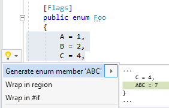

## Generate combined enum member

| Property           | Value                                    |
| ------------------ | ---------------------------------------- |
| Id                 | RR0055                                   |
| Title              | Generate combined enum member            |
| Syntax             | enum declaration \(with FlagsAttribute\) |
| Enabled by Default | &#x2713;                                 |

### Usage

## See Also

* [Full list of refactorings](Refactorings.md)

*\(Generated with [DotMarkdown](http://github.com/JosefPihrt/DotMarkdown)\)*