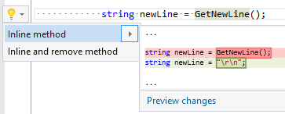

## Inline method

| Property           | Value             |
| ------------------ | ----------------- |
| Id                 | RR0062            |
| Title              | Inline method     |
| Syntax             | method invocation |
| Enabled by Default | &#x2713;          |

### Usage

## See Also

* [Full list of refactorings](Refactorings.md)

*\(Generated with [DotMarkdown](http://github.com/JosefPihrt/DotMarkdown)\)*