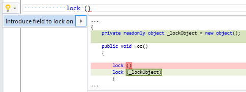

## Introduce field to lock on

| Property           | Value                      |
| ------------------ | -------------------------- |
| Id                 | RR0067                     |
| Title              | Introduce field to lock on |
| Syntax             | lock statement             |
| Span               | missing expression         |
| Enabled by Default | &#x2713;                   |

### Usage

## See Also

* [Full list of refactorings](Refactorings.md)

*\(Generated with [DotMarkdown](http://github.com/JosefPihrt/DotMarkdown)\)*