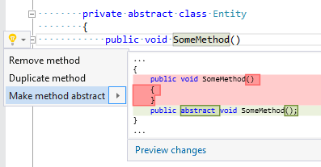

## Make member abstract

| Property           | Value                                                   |
| ------------------ | ------------------------------------------------------- |
| Id                 | RR0069                                                  |
| Title              | Make member abstract                                    |
| Syntax             | non\-abstract indexer/method/property in abstract class |
| Span               | indexer/method/property header                          |
| Enabled by Default | &#x2713;                                                |

### Usage

## See Also

* [Full list of refactorings](Refactorings.md)

*\(Generated with [DotMarkdown](http://github.com/JosefPihrt/DotMarkdown)\)*