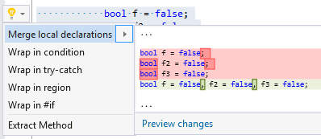

## Merge local declarations

| Property           | Value                             |
| ------------------ | --------------------------------- |
| Id                 | RR0077                            |
| Title              | Merge local declarations          |
| Syntax             | local declarations with same type |
| Enabled by Default | &#x2713;                          |

### Usage

## See Also

* [Full list of refactorings](Refactorings.md)

*\(Generated with [DotMarkdown](http://github.com/JosefPihrt/DotMarkdown)\)*