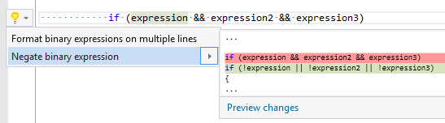

## Invert binary expression

| Property           | Value                     |
| ------------------ | ------------------------- |
| Id                 | RR0079                    |
| Title              | Invert binary expression  |
| Syntax             | logical and/or expression |
| Enabled by Default | &#x2713;                  |

### Usage

## See Also

* [Full list of refactorings](Refactorings.md)

*\(Generated with [DotMarkdown](http://github.com/JosefPihrt/DotMarkdown)\)*