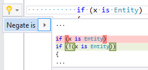

## Invert is expression

| Property           | Value                |
| ------------------ | -------------------- |
| Id                 | RR0081               |
| Title              | Invert is expression |
| Syntax             | is expression        |
| Span               | operator             |
| Enabled by Default | &#x2713;             |

### Usage

## See Also

* [Full list of refactorings](Refactorings.md)

*\(Generated with [DotMarkdown](http://github.com/JosefPihrt/DotMarkdown)\)*