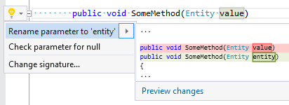

## Rename parameter according to its type name

| Property           | Value                                       |
| ------------------ | ------------------------------------------- |
| Id                 | RR0114                                      |
| Title              | Rename parameter according to its type name |
| Syntax             | parameter                                   |
| Span               | parameter identifier                        |
| Enabled by Default | &#x2713;                                    |

### Usage

## See Also

* [Full list of refactorings](Refactorings.md)

*\(Generated with [DotMarkdown](http://github.com/JosefPihrt/DotMarkdown)\)*