## Roslynator Refactorings

#### Add boolean comparison

* **Syntax**: boolean? expression in place where must be boolean expression

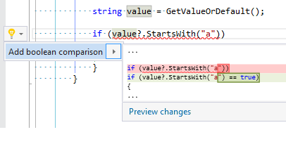

#### Add braces

* **Syntax**: do statement, else clause, fixed statement, for statement, foreach statement, if statement, lock statement, using statement, while statement
* **Scope**: embedded statement

#### Add braces to if-else

* **Syntax**: if-else chain
* **Scope**: embedded statement

#### Add braces to switch section

* **Syntax**: switch section
* **Scope**: statements

#### Add braces to switch sections

* **Syntax**: switch statement
* **Scope**: switch keyword

#### Add cast expression

* **Syntax**: argument, assignment expression, return statement, variable declaration

#### Add 'ConfigureAwait(false)'

* **Syntax**: awaitable method invocation
* **Scope**: method name

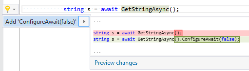

#### Add default value to parameter

* **Syntax**: parameter without default value
* **Scope**: identifier

#### Add default value to return statement

* **Syntax**: return statement without expression

#### Add identifier to variable declaration

* **Syntax**: variable declaration

#### Add parameter name to argument

* **Syntax**: argument list

#### Add parameter name to parameter

* **Syntax**: parameter
* **Scope**: missing identifier

#### Add 'To...' method invocation

* **Syntax**: argument, assignment expression, return statement, variable declaration

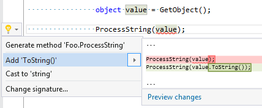

#### Add using directive

* **Syntax**: qualified name
* **Scope**: selected namespace

#### Add using static directive

* **Syntax**: member access expression (public or internal static class)
* **Scope**: selected class name

#### Change explicit type to 'var'

* **Syntax**: variable declaration, foreach statement
* **Scope**: type

#### Change method return type to 'void'

* **Syntax**: method

#### Change method/property/indexer type according to return expression

* **Syntax**: return statement in method/property/indexer

#### Change method/property/indexer type according to yield return expression

* **Syntax**: yield return statement in method/property/indexer

#### Change type according to expression

* **Syntax**: variable declaration, foreach statement
* **Scope**: type

#### Change 'var' to explicit type

* **Syntax**: variable declaration, foreach statetement
* **Scope**: type

#### Check parameter for null

* **Syntax**: parameter
* **Scope**: parameter identifier

#### Collapse to initalizer

* **Syntax**: object creation followed with assignment(s)

#### Comment out member

* **Syntax**: method, constructor, property, indexer, operator, event, namespace, class, struct, interface
* **Scope**: opening or closing brace

#### Comment out statement

* **Syntax**: do statement, fixed statement, for statement, foreach statement, checked statement, if statement, lock statement, switch statement, try statement, unchecked statement, unsafe statement, using statement, while statement
* **Scope**: opening or closing brace

#### Create condition from boolean expression

* **Syntax**: return statement, yield return statement, expression statement
* **Scope**: boolean expression

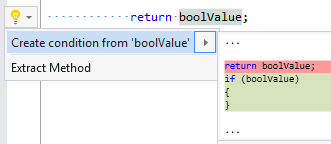

#### Duplicate argument

* **Syntax**: missing argument

#### Duplicate member

* **Syntax**: method, constructor, property, indexer, operator, event, namespace, class, struct, interface
* **Scope**: opening or closing brace

#### Duplicate parameter

* **Syntax**: missing parameter

#### Duplicate statement

* **Syntax**: do statement, fixed statement, for statement, foreach statement, checked statement, if statement, lock statement, switch statement, try statement, unchecked statement, unsafe statement, using statement, while statement
* **Scope**: opening or closing brace

#### Expand assignment expression

* **Syntax**: assignment expression
* **Scope**: operator

#### Expand coalesce expression

* **Syntax**: coalesce expression
* **Scope**: ?? operator

#### Expand event

* **Syntax**: event field declaration

#### Expand expression-bodied member

* **Syntax**: expression body

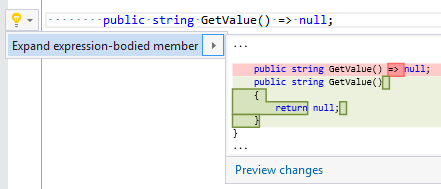

#### Expand initializer

* **Syntax**: initializer

#### Expand lambda expression body

* **Syntax**: lambda expression
* **Scope**: body

#### Expand property

* **Syntax**: auto-property

#### Expand property and add backing field

* **Syntax**: auto-property

#### Extract declaration from using statement

* **Syntax**: using statement
* **Scope**: declaration

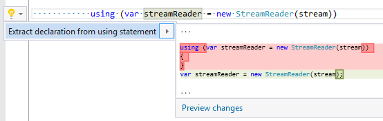

#### Extract expression from condition

* **Syntax**: if statement, while statement
* **Scope**: condition

#### Extract generic type

* **Syntax**: generic name with single type argument
* **Scope**: type argument

#### Extract statement(s)

* **Syntax**: else clause, fixed statement, for statement, foreach statement, checked statement, if statement, lock statement, try statement, unsafe statement, using statement, while statement

#### Extract type declaration to a new file

* **Syntax**: class declaration, struct declaration, interface declaration, enum declaration, delegate declaration
* **Scope**: identifier

#### Format accessor braces

* **Syntax**: get accessor, set accessor, add accessor, remove accessor
* **Scope**: block

#### Format argument list

* **Syntax**: argument list

#### Format binary expression

* **Syntax**: logical and/or expression, bitwise and/or expression

#### Format conditional expression

* **Syntax**: conditional expression

#### Format expression chain

* **Syntax**: expression chain

#### Format initializer

* **Syntax**: initializer

#### Format parameter list

* **Syntax**: parameter list

#### Generate base constructors

* **Syntax**: class declaration
* **Scope**: identifier

#### Generate 'OnEvent' method

* **Syntax**: event
* **Scope**: identifier

#### Generate switch sections

* **Syntax**: switch statement (that is empty or contains only default section)

#### Initialize local with default value

* **Syntax**: local declaration without initializer
* **Scope**: identifier

#### Inline method

* **Syntax**: static/extension method invocation

#### Insert string interpolation

* **Syntax**: string literal, interpolated string

#### Introduce and initialize field

* **Syntax**: constructor parameter

#### Introduce and initialize property

* **Syntax**: constructor parameter

#### Introduce constructor

* **Syntax**: field, property

#### Make member abstract

* **Syntax**: non-abstract indexer/method/property in abstract class
* **Scope**: indexer/method/property header

#### Mark all members as static

* **Syntax**: non-static field/method/property/event in static class

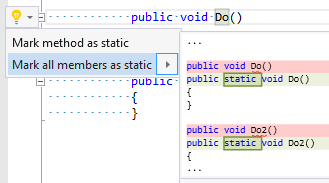

#### Mark member as static

* **Syntax**: non-static field/method/property/event in static class

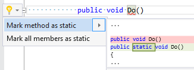

#### Merge assignment expression with return statement

* **Syntax**: assignment expression followed with return statement

#### Merge attributes

* **Syntax**: selected attribute lists

#### Merge if statements

* **Syntax**: selected if statements

#### Merge local declarations

* **Syntax**: local declarations with same type

#### Merge string literals

* **Syntax**: concatenated string literals

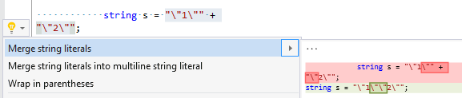

#### Merge string literals into multiline string literal

* **Syntax**: concatenated string literals

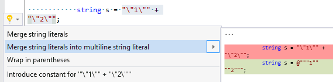

#### Negate binary expression

* **Syntax**: logical and/or expression

#### Negate boolean literal

* **Syntax**: boolean literal

#### Negate operator

* **Syntax**: !=, &&, ||, <, <=, ==, >, >=

#### Notify property changed

* **Syntax**: property in class/struct that implements INotifyPropertyChanged
* **Scope**: setter

#### Parenthesize expression

* **Syntax**: selected expression

#### Promote local to parameter

* **Syntax**: local declaration in method

#### Remove all comments

* **Syntax**: singleline/multiline comment, singleline/multiline documentation documentation comment

#### Remove all comments (except documentation comments)

* **Syntax**: singleline/multiline comment

#### Remove all documentation comments

* **Syntax**: singleline/multiline documentation comment

#### Remove all member declarations

* **Syntax**: namespace, class, struct, interface
* **Scope**: opening or closing brace

#### Remove all preprocessor directives

* **Syntax**: preprocessor directive

#### Remove all region directives

* **Syntax**: region directive

#### Remove all statements

* **Syntax**: method, constructor, operator
* **Scope**: opening or closing brace

#### Remove all switch sections

* **Syntax**: switch statement
* **Scope**: opening or closing brace

#### Remove braces

* **Syntax**: do statement, else clause, fixed statement, for statement, foreach statement, if statement, lock statement, using statement, while statement
* **Scope**: block with a single statement

#### Remove braces from if-else

* **Syntax**: if-else chain
* **Scope**: embedded statement

#### Remove braces from switch section

* **Syntax**: switch section
* **Scope**: block

#### Remove braces from switch sections

* **Syntax**: switch statement
* **Scope**: switch keyword

#### Remove comment

* **Syntax**: singleline/multiline comment, singleline/multiline xml documentation comment

#### Remove condition from last else clause

* **Syntax**: else clause
* **Scope**: else keyword

#### Remove directive and related directives

* **Syntax**: preprocessor directive, region directive

#### Remove empty lines

* **Syntax**: selected lines

#### Remove interpolation

* **Syntax**: string interpolation
* **Scope**: opening or closing brace

#### Remove member

* **Syntax**: method, constructor, property, indexer, operator, event, namespace, class, struct, interface
* **Scope**: opening or closing brace

#### Remove member declarations above/below

* **Syntax**: empty line between member declarations

#### Remove parameter name from argument

* **Syntax**: selected argument(s)

#### Remove parentheses

* **Syntax**: parenthesized expression
* **Scope**: opening or closing parenthesis

#### Remove property initializer

* **Syntax**: property initializer

#### Remove region

* **Syntax**: region directive

#### Remove statement

* **Syntax**: do statement, fixed statement, for statement, foreach statement, checked statement, if statement, lock statement, switch statement, try statement, unchecked statement, unsafe statement, using statement, while statement
* **Scope**: open/close brace

#### Remove statements from switch sections

* **Syntax**: selected switch sections

#### Remove using alias directive

* **Syntax**: using alias directive
* **Scope**: identifier

#### Rename backing field according to property name

* **Syntax**: field identifier inside property declaration

#### Rename identifier according to type name

* **Syntax**: foreach statement, local/field/constant declaration
* **Scope**: identifier

#### Rename method according to type name

* **Syntax**: method

#### Rename parameter according to its type name

* **Syntax**: parameter
* **Scope**: parameter identifier

#### Rename property according to type name

* **Syntax**: property identifier

#### Replace "" with 'string.Empty'

* **Syntax**: empty string literal

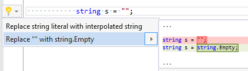

#### Replace anonymous method with lambda expression

* **Syntax**: anonymous method
* **Scope**: delegate keyword

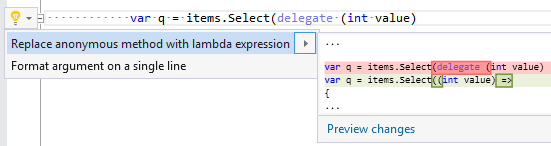

#### Replace 'Any/All' with 'All/Any'

* **Syntax**: Any(Func<T, bool> or All(Func<T, bool> from System.Linq.Enumerable namespace
* **Scope**: method name

#### Replace as expression with cast expression

* **Syntax**: as expression
* **Scope**: operator

#### Replace conditional expression with expression

* **Syntax**: conditional expression
* **Scope**: selected true/false expression

#### Replace conditional expression with if-else

* **Syntax**: conditional expression

#### Replace constant with field

* **Syntax**: constant declaration

#### Replace 'Count/Length' with 'Length/Count'

* **Syntax**: member access expression
* **Scope**: name

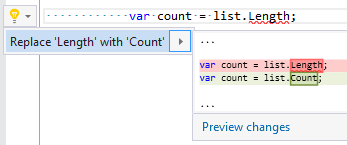

#### Replace do statement with while statement

* **Syntax**: do statement
* **Scope**: do keyword

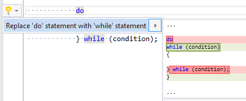

#### Replace equals expression with string.Equals

* **Syntax**: equals expression
* **Scope**: operator

#### Replace field with constant

* **Syntax**: read-only field

#### Replace for statement with foreach statement

* **Syntax**: for statement

#### Replace foreach statement with for statement

* **Syntax**: foreach statement

#### Replace 'HasFlag' with bitwise operation

* **Syntax**: Enum.HasFlag method invocation

#### Replace if-else with conditional expression

* **Syntax**: conditional expression

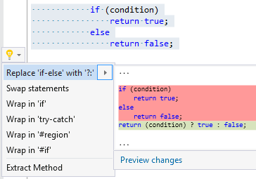

#### Replace if-else with switch statement

* **Syntax**: if statement

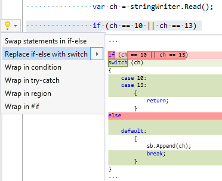

#### Replace increment operator with decrement operator

* **Syntax**: prefix/postfix unary expression

#### Replace interpolated string with interpolation expression

* **Syntax**: interpolated string with single interpolation and no text
* **Scope**: interpolation

#### Replace interpolated string with string literal

* **Syntax**: Interpolated string without any interpolation

#### Replace method invocation with '[]'

* **Syntax**: First/Last/ElementAt method invocation
* **Scope**: method name

![Replace method invocation with '[]'](../../images/refactorings/ReplaceMethodInvocationWithElementAccess.png)

#### Replace method with property

* **Syntax**: method
* **Scope**: method header

#### Replace prefix operator to postfix operator

* **Syntax**: prefix/postfix unary expression

#### Replace property with method

* **Syntax**: read-only property
* **Scope**: property header

#### Replace regular string literal with verbatim string literal

* **Syntax**: regular string literal

#### Replace string literal with character literal

* **Syntax**: string literal

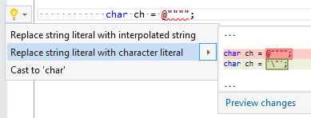

#### Replace 'string.Empty' with ""

* **Syntax**: string.Empty

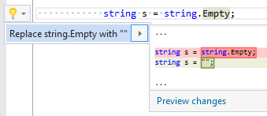

#### Replace 'string.Format' with interpolated string

* **Syntax**: string.Format method

#### Replace switch statement with if-else

* **Syntax**: switch statement
* **Scope**: switch keyword

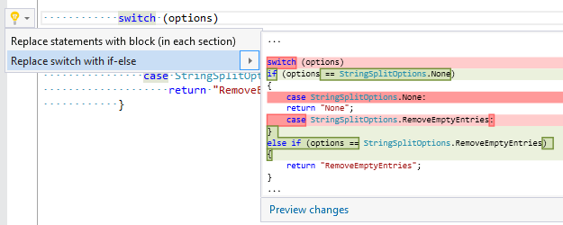

#### Replace verbatim string literal with regular string literal

* **Syntax**: verbatim string literal

#### Replace verbatim string literal with regular string literals

* **Syntax**: multiline verbatim string literal

#### Replace while statement with do statement

* **Syntax**: while statement
* **Scope**: while keyword

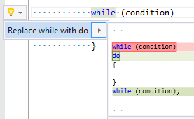

#### Reverse for loop

* **Syntax**: for statement

#### Simplify lambda expression

* **Syntax**: lambda expression with block with single single-line statement
* **Scope**: body

#### Split attributes

* **Syntax**: selected attribute list

#### Split variable declaration

* **Syntax**: local declaration, field declaration, event field declaration

#### Swap expressions in binary expression

* **Syntax**: logical and/or expression
* **Scope**: binary operator

#### Swap expressions in conditional expression

* **Syntax**: conditional expression
* **Scope**: condition

#### Swap member declarations

* **Syntax**: empty line between member declarations

#### Swap statements in if-else

* **Syntax**: if statement
* **Scope**: if keyword

#### Uncomment

* **Syntax**: single-line comment(s)

#### Use expression-bodied member

* **Syntax**: method, property, indexer, operator
* **Scope**: body or accessor list

#### Wrap in #if directive

* **Syntax**: selected lines

#### Wrap in condition

* **Syntax**: selected statements

#### Wrap in region

* **Syntax**: selected lines

#### Wrap in try-catch

* **Syntax**: selected statements

#### Wrap in using statement

* **Syntax**: local declaration of type that implements IDisposable

